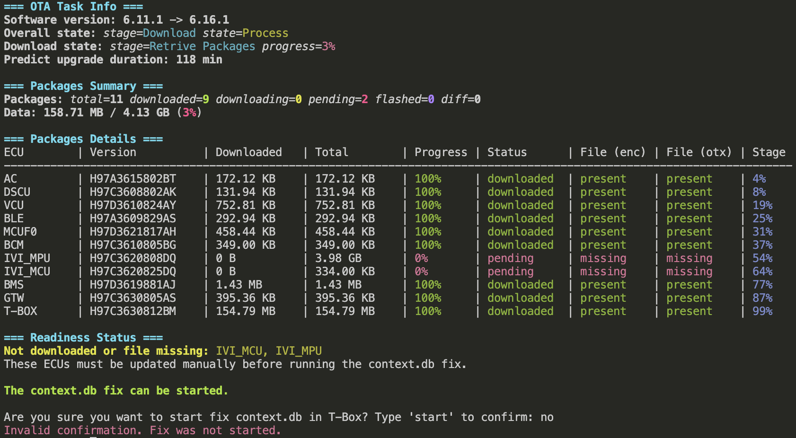
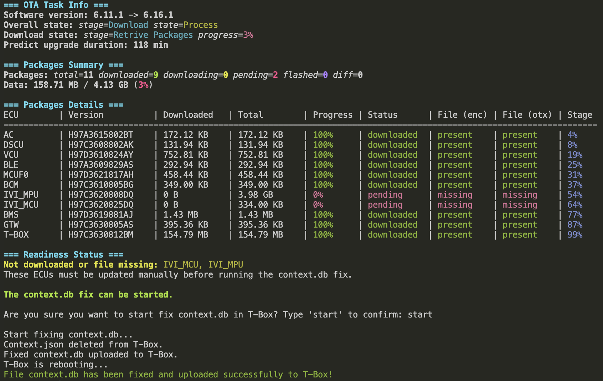
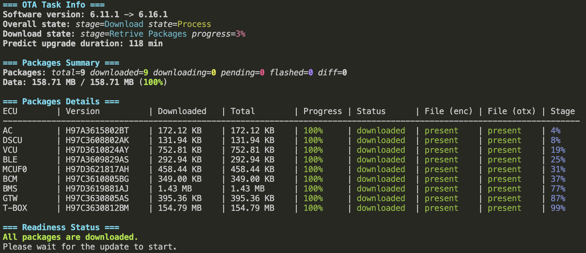

# Voyah Free OTA-Update Fix

CLI-утилита для анализа и исправления зависших пакетов OTA-обновления на автомобиле Voyah Free.

> [!WARNING]
> Использование этой утилиты и любых связанных инструкций выполняется полностью на ваш страх и риск.  
> Автор не несет никакой ответственности за возможные последствия, включая (но не ограничиваясь): повреждение автомобиля, блокировку, потерю данных, некорректную работу систем автомобиля, утрату гарантии, простой, прямые или косвенные убытки.  
> Перед применением убедитесь, что вы имеете актуальные резервные копии, полностью понимаете, что делаете, и готовы принять на себя все риски, связанные с использованием данной утилиты.

## Что делает фикс

1. Подключается к T-Box (`SSH` + `SFTP`).
2. Скачивает `/mnt/ota/data/fota/context.db`.
3. Анализирует `context.db` и выводит в консоль:
   - версию ПО,
   - общий статус OTA,
   - сводку по пакетам,
   - детальную таблицу по каждому ECU,
   - готовность к запуску фикса.
4. Если скачаны все пакеты кроме `IVI_MCU`/`IVI_MPU`/`T-BOX`, то предлагает выполнить фикс.
5. Перед изменением делает локальный backup-архив.
6. При наличии удаляет `context.json` на T-Box.
7. Загружает исправленный `context.db` и выполняет `reboot`.

## Требования
   - Автомобиль Voyah Free с зависшими пакетами OTA-обновления.
   - Компьютер с WiFi сетью и поддержкой `SSH` и `SFTP` (Linux, macOS, Windows).
   - Отформатированный в FAT32 USB-накопитель.

## Пошаговая инструкция (подробно)

### Шаг 1. Скачайте voyah-free-update-fix для вашей операционной системы

1. Откройте страницу [Releases](https://github.com/mkhodorev/voyah-free-update-fix/releases).
2. Скачайте архив под вашу ОС:
   - `voyah-free-update-fix_v0.0.1_darwin_amd64.tar.gz` для macOS (Intel),
   - `voyah-free-update-fix_v0.0.1_darwin_arm64.tar.gz` для macOS (Apple Silicon),
   - `voyah-free-update-fix_v0.0.1_windows_amd64.zip` для Windows x64,
   - `voyah-free-update-fix_v0.0.1_linux_amd64.tar.gz` для Linux x64.
3. Распакуйте архив в отдельную папку, например `voyah-free-update-fix`.


### Шаг 2. Прошейте T-Box на версию с доступом по SSH

1. Скопируйте файл `T-BOX_H97C3630812AP_alfa_1_0_root12345.bin` из директории `tbox` [Яндекс.Диск](https://disk.yandex.ru/d/0SZmiXV_meXrrA).
2. Запишите файл `T-BOX_H97C3630812AP_alfa_1_0_root12345.bin` на отформатированный в FAT32 USB-накопитель в директорию `update`.
3. Безопасно извлеките USB-накопитель из компьютера.
4. Вставьте USB-накопитель (USB-A) в автомобиль.
5. Через инженерное меню автомобиля выполните обновление T-Box:
   - в мультимедиа автомобиля, нажмите на изображение машинки.
   - перейдите в Settings (Настройки) -> System (Система).
   - быстро нажмите на надпись "Hardware Version" (Версия аппаратного обеспечения/ Версия платы) 8 раз.
   - введите динамический пароль (доступен в Telegram-чате [@voyahchat](https://t.me/voyahchat) или в [voyahchat](https://voyahchat.ru/common/password)).
   - промотайте вниз и нажмите на пункт `TBOX相关操作` (Операции, связанные с TBOX).
   - выберите первый пункт `TBOX升级` (Обновление TBOX).
   - нажмите на единственную белую надпись `开始升级` (Начать обновление).
   - если проценты не побежали, попробуйте достать флешку и вставить заново, подождать секунд 30 и нажать еще раз на надпись `开始升级` (Начать обновление).
   - если появилась надпись `升级失败` (Ошибка обновления), то попробуйте снова извлечь и вставить флешку, подождать и нажать на `开始升级` (Начать обновление) еще раз.
   - ждем появления надписи `正在升级` (Идет обновление).
   - после старта процесса обновления пропадет сеть автомобиля.
   - дождитесь завершения прошивки (займет несколько минут).
   - после появления сети T-Box будет прошит и готов к подключению по SSH.
6. Проверьте успешность прошивки T-Box и его версию:
   - в мультимедиа автомобиля, нажмите на изображение машинки.
   - перейдите в Settings (Настройки) -> System (Система)
   - в `T-Box hardware version` должна быть `H97C3630812AP-1.6.9p`.


### Шаг 3. Подключитесь к WiFi сети автомобиля

1. В мультимедиа автомобиля, нажмите на изображение машинки.
2. Перейдите в Settings (Настройки) -> Network (Сеть).
3. Включите AP Hotspot (Точка доступа).
4. Подключите компьютер к WiFi сети, которая будет называться `Voyah...`.


### Шаг 4. Запустите утилиту voyah-free-update-fix

Для MacOS:
1. Запустите Терминал.
2. Перейдите в директорию с утилитой `voyah-free-update-fix`
3. Выполните команду для запуска утилиты:

```bash
./voyah-free-update-fix-darwin-arm64
```
4. Если запуск заблокирован политикой безопасности, откройте "Системные настройки" -> "Безопасность и конфиденциальность" и нажмите "Разрешить" для `voyah-free-update-fix-darwin-arm64`, после чего повторите попытку запуска.

Для Windows:
1. Запустите PowerShell или Командную строку.
2. Перейдите в директорию с утилитой `voyah-free-update-fix`.
3. Выполните команду для запуска утилиты:

```powershell
.\voyah-free-update-fix-windows-amd64.exe
```

По умолчанию используются параметры:

   - `-ip 172.16.104.20`
   - `-port 22`
   - `-username root`
   - `-password 12345`
   - `-backup-dir backup`

Если ваши параметры отличаются от значений по умолчанию, передайте их явно:

```bash
./voyah-free-update-fix-darwin-arm64 \
  -ip 172.16.104.20 \
  -port 22 \
  -username root \
  -password 12345 \
  -backup-dir ./backup
```


### Шаг 5. Проверьте подключение к T-Box и состояние OTA-обновления

Утилита `voyah-free-update-fix` попытается подключиться к T-Box и скачать `context.db`.

Если подключение к T-Box не удалось установить: `t-box connection error:`, то проверьте:
   - стабильность WiFi соединения.
   - прошивку T-Box.
   - правильность IP-адреса, порта, логина и пароля (если использовались кастомные параметры).
   - если прошивка T-Box верная и WiFi соединение стабильно, то выполните фикс для исправления маршрутизации Мультимедиа с T-Box. (`fix_routing` можно найти в [Яндекс.Диск](https://disk.yandex.ru/d/0SZmiXV_meXrrA))

Если подключение к T-Box установлено успешно, то утилита выведет информацию о статусе OTA-обновления. 

Пример застрявшего на 3% 6.16.1 OTA-обновления:


Проверьте блок `=== Readiness Status ===` для понимания, разрешён ли запуск фикса:

Если обязательные пакеты не скачаны, то запуск фикса не будет разрешён. Нужно дождаться загрузки OTA-обновления автомобиля, после чего повторно запустить утилиту для проверки готовности к фиксу.

Если утилита показывает, что фикс можно запускать `The context.db fix can be started.`, но при этом отсутствуют пакеты `IVI_MCU`/`IVI_MPU`, то нужно перед запуском фикса обновить IVI пакеты, как описано в шаге 7:
   - введите `no` или любой другой текст, чтобы выйти из утилиты без запуска фикса.
   - переходите к следующему шагу для обновления IVI пакетов.


### Шаг 6. Обновление IVI пакетов 

1. Скопируйте файлы `update.zip` и `update-mcu.zip` из директории требуемой версии обновления [Яндекс.Диска](https://disk.yandex.ru/d/0SZmiXV_meXrrA)
2. Запишите файлы на отформатированный в FAT32 USB-накопитель в директорию `update`.
3. Перезагрузите Мультимедиа в режим `recovery` (нажмите и удерживайте кнопки `звездочка`+`фотоаппарат`).
4. Меняем язык на английский
   - выберите пункт 11
   - в диалоге нажмите левую кнопку
5. Подключите USB-накопитель к автомобилю
   - появится надпись `U-disk insertion detected.`
6. Выберите пункт 2 `upgrade all intelligent cockpit software` для прошивки образа
   - подтвердите нажатием OK в диалоге
   - дождитесь завершения процесса (займет примерно 10 минут)
   - после завершения обновления появится обратный отсчет с надписью `Touch screen to exit`
   - нужно коснуться экрана, чтобы продолжить процесс обновления
7. Выберите пункт 5 `upgrade MCU software` для прошивки пакета MCU
   - подтвердите нажатием OK в диалоге
   - дождитесь завершения процесса (займет примерно 3 минуты)
8. После завершения ожидаем загрузку Мультимедиа


### Шаг 7. Запустите фикс для исправления `context.db`

1. После обновления IVI пакетов повторно подключитесь к WiFi автомобиля и запустите утилиту.
2. Дождитесь завершения анализа `context.db` и проверьте блок `=== Readiness Status ===`.
3. Если утилита показывает, что фикс можно запускать `The context.db fix can be started.`
4. Подтвердите запуск фикса, введя `start` в консоли.
5. Утилита создаст backup, применит правку и перезагрузит T-Box.
6. Дождитесь завершения процесса и не отключайте питание автомобиля во время выполнения.
7. После завершения ожидайте появления сообщения о готовности к обновлению автомобиля.


### Шаг 8. Прошивка T-Box
Если T-Box отсутствовал в пакетах обновления или был не скачан, то после успешного применения фикса и выполнения обновления нужно будет вернуть T-Box на актуальную версию, соответствующую новой прошивке.
Для этого повторите Шаг 3, используя USB-накопитель с нужной версией прошивки для T-Box.


## Что выводит в консоль

Скрин успешного применения фикса для 6.16.1 OTA-обновления:


Скрин статуса OTA-обновления после применения фикса:



Утилита печатает несколько блоков:

   - `=== OTA Task Info ===` — базовая информация по задаче OTA.
   - `=== Packages Summary ===` — агрегированная статистика по пакетам.
   - `=== Packages Details ===` — таблица по ECU (прогресс, статус, наличие файлов).
   - `=== Readiness Status ===` — можно ли запускать фикс.

Если фикс разрешён, будет интерактивное подтверждение:

```text
The context.db fix can be started.

Are you sure you want to start fix context.db in T-Box? Type 'start' to confirm:
```

Успешный сценарий сопровождается сообщениями:

   - `Context.json deleted from T-Box.` (если файл существовал)
   - `Fixed context.db uploaded to T-Box.`
   - `T-Box is rebooting...`
   - `File context.db has been fixed and uploaded successfully to T-Box!`

Если подтверждение введено неверно:

   - `Invalid confirmation. Fix was not started.`

## Что попадает в backup

Перед правкой создаётся zip-архив в `backup` (или другом указанном каталоге) с именем `context.backup.YYYYMMDD_HHMMSS.zip`, который содержит:
   - `context.db` — скачанный с T-Box до правки.
   - `context.json` — если он был на T-Box, для сохранения текущего состояния.

## Важные замечания
   - Убедитесь, что у вас есть стабильное соединение с T-Box во время выполнения утилиты.
   - Не отключайте питание автомобиля и не прерывайте процесс, чтобы избежать возможных проблем.
   - Рекомендуется делать резервные копии важных данных автомобиля перед использованием утилиты.

## Благодарности
Спасибо сообществу Voyah Free в Telegram за предоставленные данные по OTA-обновлениям:
[@voyahchat](https://t.me/voyahchat)

## Лицензия
Проект распространяется на условиях [LICENSE](LICENSE), запрещающей коммерческое использование без письменного разрешения автора.
